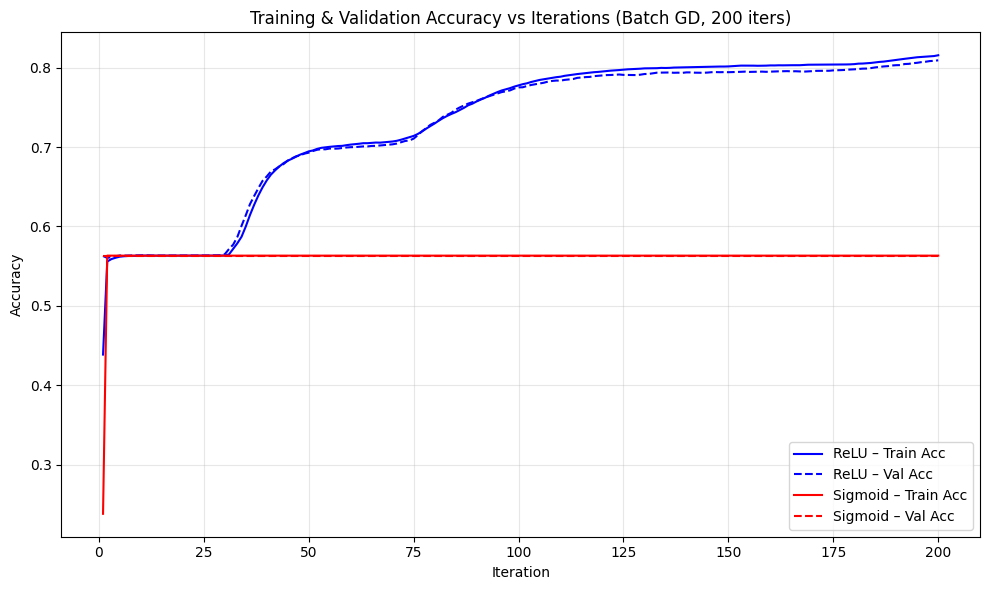
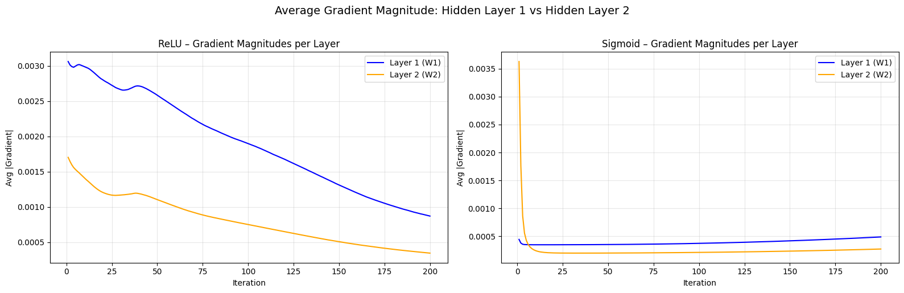
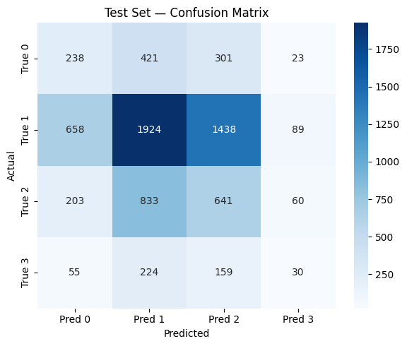
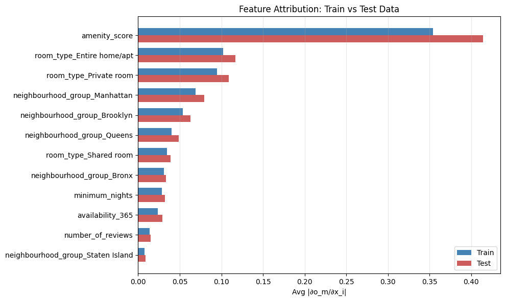

<p align="center">
  
</p>

<h1 align="center">🧠 AI600 — Deep Learning: Assignment 1</h1>

<p align="center">
  <b>Feedforward Neural Networks from Scratch using NumPy</b><br/>
  Lahore University of Management Sciences · Spring 2026
</p>

<p align="center">
  
  
  
  
</p>

---

## 📋 Overview

A **multi-class feedforward neural network** built entirely from scratch using **NumPy** — no PyTorch, no TensorFlow. The task is to classify Airbnb listings into 4 price categories using tabular features like neighbourhood, room type, amenity score, and more.

### Key Results

| Metric | ReLU | Sigmoid |
|--------|------|---------|
| Train Accuracy | **81.55%** | 56.32% |
| Val Accuracy | **80.92%** | 56.32% |
| Test Accuracy | **38.82%** | — |

> The large train→test gap (42.7%) reveals a distribution shift caused by missing-value imputation patterns in training data that don't exist in the clean test set.

---

## 🏗️ Architecture

```
Input (13) → Dense(64, ReLU) → Dense(32, ReLU) → Dense(4, Softmax)
```

- **Loss:** Cross-entropy with softmax
- **Optimizer:** Batch gradient descent (lr=0.01, 200 iterations)
- **Preprocessing:** One-hot encoding, z-score normalization, median/mode imputation

---

## 📂 Repository Structure

```
.
├── part1.ipynb              # All code — EDA, MLP, training, evaluation
├── 25280057_report.tex      # LaTeX source for the report
├── 25280057_report.pdf      # Compiled PDF report
├── train.csv                # Training dataset (41,348 samples)
├── test.csv                 # Test dataset (7,297 samples)
├── requirements.txt         # Python dependencies
├── images/                  # Plots and figures used in the report
│   ├── training_validation_acc.png
│   ├── reluvssigmoidgradient.png
│   ├── correlationmatrix.png
│   ├── testsetconfusion.png
│   ├── gradientbasedfeatures.png
│   ├── featureattribution_trainvstest.png
│   └── ...
└── README.md
```

---

## 🔬 Assignment Parts

### Part A — Exploratory Data Analysis
- Dataset inspection, missing value analysis (5,406 NaN values across 6 columns)
- Class imbalance: Class 1 dominates at 56.3%, Class 3 only 6.4%
- Feature distributions via box plots, count plots, and correlation matrix
- One-hot encoding expands features from 6 → 13

### Part B(a) — MLP Implementation & Training
- Forward pass: matrix multiplications + activation functions
- Backward pass: manual chain-rule gradient computation
- Compared **ReLU** vs **Sigmoid** activations
- ReLU reaches 81.5% accuracy; Sigmoid plateaus at 56.3% (majority-class baseline)

### Part B(b) — Gradient Magnitude Analysis
- Tracked `|∇W₁|` and `|∇W₂|` across all 200 iterations
- Sigmoid shows classic **vanishing gradient** — Layer 1 gradients are 2–6× smaller than Layer 2
- ReLU maintains healthy gradient flow with ratio close to 0.5

### Part C(a) — Gradient-Based Feature Attribution
- Implemented Aggarwal §2.8 method: `Avg |∂oₘ/∂xᵢ|` over correctly classified samples
- Top feature: `amenity_score` (0.354 for ReLU, 0.0096 for Sigmoid)
- Sigmoid attributions are compressed due to vanishing gradients

### Part C(b) — Handwritten Backpropagation
- Full chain-rule derivation for the 2-hidden-layer network
- Pseudocode for the backward pass

### Part D — Test Evaluation & Generalization
- Test accuracy drops to **38.8%** despite 81.5% training accuracy
- Classification report shows Class 3 (minority) F1-score of just 0.09
- Feature attribution shift analysis: all features show increased importance on test data
- Root cause: imputation artifacts in training data create patterns absent in test data

### Question 2 — Shared Bias Gradient Derivation
- Mathematical proof that shared bias gradient = sum of individual neuron gradients
- Analysis of convergence implications

---

## 🚀 Quick Start

```bash
# Clone the repo
git clone https://github.com/azamali9922/25280057_deeplearning_pa_1.git
cd 25280057_deeplearning_pa_1

# Create virtual environment
python -m venv ai600_env
ai600_env\Scripts\activate    # Windows
# source ai600_env/bin/activate  # Linux/Mac

# Install dependencies
pip install -r requirements.txt

# Open the notebook
jupyter notebook part1.ipynb
```

---

## 📊 Selected Visualizations

<p align="center">
  
  
</p>

<p align="center">
  
  
</p>

---

## 👤 Author

| | |
|---|---|
| **Name** | Azam Ali |
| **Roll No.** | 25280057 |
| **Course** | AI600 — Deep Learning |
| **Institution** | LUMS, School of Science & Engineering |
| **Semester** | Spring 2026 |

---

